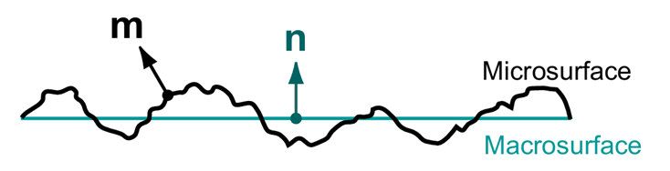
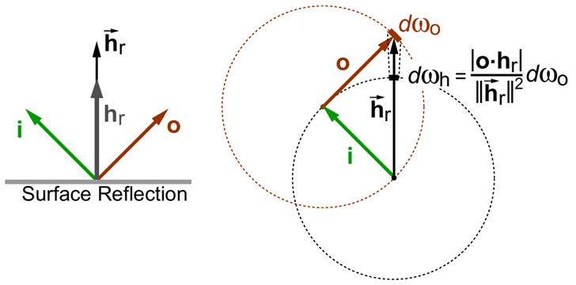
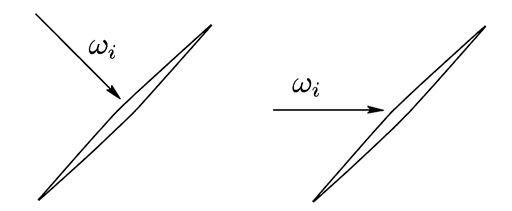
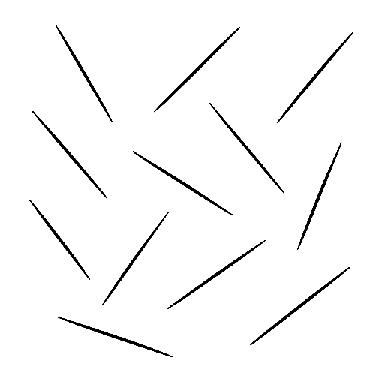
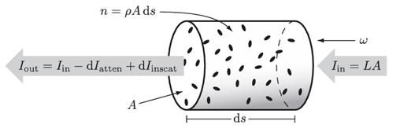

# Understanding of Microfacet And Microflake

In microfacet models, a detailed microsurface is replaced by a simplified macrosurface with a modified scattering function (BSDF) that matches the aggregate directional scattering of the microsurface. This assumes that micro surface detail is too small to be seen directly, so only the far-field directional scattering pattern matters. {B. Walter et al]

## Microfacet 이론
BSDF는 면에 빛이 어떻게 산란이 되는지를 묘사하는 함수이다. 다시 설명하자면, 입사방향 $i$의 irradiance와 방사방향 $o$의 radiance의 비율을 정의한다. 이 관계를 함수로 표현하면 $f_s(i,o,n)$이다. 반사만 구성된다면 BRDF, 투과는 BTDF로 말한다. 여기서는 반사만 이해하고 설명하겠다.

Microfacet 모델은 촘촘한 microsurface들을 단순macrosurface로 대체하고 산란 함수를 재정의한다. 이 재정의한 산란 함수는 microsurface의 방향성 산란들을 하나의 함수로 표현하여 쉽게 접근하여 모델을 정의하는 이론이다. 이 가정은 미세면들이 보이지 않을정도로 작아서, 거시적 관점에서 산란 방향 패턴을 분석하여 모델화 한다. 보통 기하학적으로 광학요소와 단일 산란(Single Scattering)만 모델화한다. microsurface내에서의 파장효과이나 2번이상 반사하는 등 복잡한 요소는 무시한다.
>&emsp;2번이상 반사 즉, Multiple Scattering은 [E. Heitz et al]에 연구되었다.

 그림1

### 함수항 D, G
D항은 microfacet 분포함수이고, G는 microfacet의 시각적 영향을 주는 비율값을 주는 함수 이다.

### 이상적 반사BRDF(Ideal Reflection)
렌더링식에서 완벽한 평변 반사를 표현하는 BRDF를 대입하면,

$$
L(o)=\int_{\Omega}f_r(i,o)L_i(i)|n\cdot i|\text{d}\omega_i=F_r(r)L_i(r)
$$

완벽한 평변 반사이기 때문에, 반사방향은 입사방향 $i$가 있으면 반사방향은 $r$로 고정이 된다. 이 식을 Dirac 델타함수를 써서 적분을 단순화 할 수 있다. Dirac 델타함수는 수학적인 함수가 아닌 일반화된 함수로 단순화된 식으로 유도할 수 있다.

$$
L(o)=\int\delta(i-r)F_r(i)L_i(i)|n \cdot i|\text{d}\omega_i=F_r(r)L_i(r)|n \cdot r|
$$

그리고 완벽한 평면 반사를 표현하기에는 $|n \cdot r|$이 빠져야 한다. 그러므로,

$$
f_r(i,o)=F_r(r)\frac{\delta(i-r)}{|n \cdot r|}
$$

으로 유도된다.
>Dirac 델타 함수를 사용해서 적분식을 제거하고 식을 단순화 하는데 사용되었다.

### Macrosurface BSDF Integral
Macrosurface BSDF모델은 미시적관점에서 이뤄지는 산란의 합 들로 구성한다. 즉 Microsurface단계에서 보이는 모든 시각적인 영향을 단일모델로 표현가능하게 총합(적분)하여 계산하게 한다. 미세면들의 노멀을 $m$ 으로 정의하고 시각적으로 전달되는 모든 면들을 D항 G항의 곱으로 표현한다. 정확한 요소를 적용하기 위해 미세면들로 입사하는 irradiance량을 microsurface로 변환하고 산란된 radiance들을 다시 macrosurface로 변환하려 돌려준다.

$$
f_s(i,o,n)=\int |\frac{i \cdot m}{i \cdot n}| f_s^m(i,o,m) |\frac{o \cdot m}{o \cdot n}|G(i,o,m)D(m)\text{d}\omega_m \quad(1)
$$

위 수식의 의미를 풀어쓴다면,

$$
f_s(i,o,n)=\int(i를\thinspace m으로\thinspace 변환)\cdot(m의\thinspace 반사와\thinspace 투과함수)\cdot(o를\thinspace m으로\thinspace 변환)\cdot G \cdot D \cdot 미소방향m
$$

>$i$와 $o$를 $m$으로 변환이라고 풀어 썼지만, 좀더 정확하게 말하면 각각 $i,o$를 노멀 $n$ 으로 입사량과 microsurface 노멀 $m$ 과 입사량의 기하학적인 관계를 말한다

$f_s^m(i,o,m)$은 이상적인(ideal) 반사와 투과 함수로 정의하고, 본 문서에서는 반사만 다룬다.

## Microsurface Specualr BSDFs
다시한번 언급하면 반반한(flat) 거울면들의 집합체로 미세면들을 정의하고, 이 면들을 거시적 관점으로 전환하여 모델화 시킨것이 Microfacet 분포 모델이라고 할 수 있다. 입사하는 에너지량($\rho$)이 입사방향($i$)에서 단일 스페큘러 반사 방향($o$)일때, 스페큘러 BSDF를 다음과 정의한다.

$$
f_s^m(i,o,m)=\rho\frac{\delta_{\omega_o}(s, o)}{|o \cdot m|}
$$

$o$방향 입체각(solid-angle)을 측정량을 $\text{d}\omega_{o}$로 표현하고, 이 측정량으로 적분을 하면 다음 과 같이 된다:

$$
\int_{\Omega}g(o)\delta_{\omega_{o}}(s,o)\text{d}\omega_{o}=\{ \genfrac{}{}{0pt}{}{g(s)\quad \text{if} \in\Omega}{0\quad \text{otherwise}}\}
$$

[식(1)]에서 위BSDF를 사용하려면, microsurface의 노멀과 그에 맞는 입체각 변환을 도입해야한다.
먼저 입사방향과 방사방향이 주어진 상황에서 단일 microsurface노멀을 계산 할 수 있다. $i$에서 $o$로 전환될때 에너지가 산란되고, 여기서 미시적으로 노멀 역활할 microsurface노멀을 정의한다. 이 노멀은 half-vector이다. 그다음 $h$와 $m$사이의 델타 함수로 다시 BSDF를 만든다:

$$
f_s^m(i,o,m)=\rho(i,m)\frac{\delta_{\omega_{m}}(h(i,o),m)}{|o \cdot m|}||\frac{\partial\omega_{h}}{\partial\omega_{o}}||
$$

여기서 $||\frac{\partial\omega_{h}}{\partial\omega_{o}}||$는 Jocobian 행렬식 절대값이다. 이 Jacobian행렬은 $h$와 $o$간의 변환을 한다. 이 Jocobian은 두 공간의 편차 크기를 말한다. 방향 $o$의 미소 입체각 $\text{d}\omega_{o}$만큼 변화 했을때 $h$방향의 미소 입체각 $\text{d}\omega_{o}$의 변화를 말한다:

$$
||\frac{\partial\omega_{h}}{\partial\omega_{o}}||=\lim_{\text{d}\omega_{o} \to 0}\ \frac{\text{d}\omega_{h}}{\text{d}\omega_{o}}
$$

입체각은 구면의 투영된 면적에 직접적인 연관을 말한다. 그리고 이 극미량 면적은 평면에 가깝다고 볼 수 있다. 이 극소 입체각 $\text{d}\omega_{o}$이 극소 입체각 $\text{d}\omega_{h}$로 변환되는 과정을 기하학적으로 풀어내면 다음과 같다:

$$
||\frac{\partial\omega_{h}}{\partial\omega_{o}}||=\frac{|o \cdot h_{r}|}{||\vec{h_{r}}||^2} \quad(2)
$$

 그림2

### $f_r^m$ 이상적 반사(Ideal Reflection)
[식(2)]에서 좀더 풀어나가면 분모는 $o$와 $h$간의 반사 벡터의 2제곱으로 다시 풀어쓸 수 있으며,

$$
\frac{|o \cdot h_{r}|}{||\vec{h_{r}}||^2}=\frac{|o \cdot h_{r}|}{(2|o \cdot h_{r}|)^2}=\frac{1}{4|o \cdot h_{r}|}\quad(3)
$$

[식(3)]식에서는 $||\vec{h_r}||=(\vec{h_r} \cdot h_{r})$ 그리고 $(o \cdot h_r)=(i \cdot h_r)$를 사용한다. 그리고 $\rho$는 프레넬 계수 $F$와 같으므로 microsurface BSDF는,

$$
f_r^m(i,o,m)=F(i,m)\frac{\delta_{\omega_m}(h_r,m)}{4(i \cdot h_r)^2}
$$

여기서 Jacobian행렬 도입을 다른 의미로 설명해 보자면, $f_r^m$이 증가하려면 $|i \cdot h_r|$이 감소 해야한다. 즉 이 상황은 off specular(정반사외(外) 반사영역)를 연출하는 효과가 나온다.

### $f_t^m$, 이상적 투과(Ideal Refraction)
본 문서에서는 투과부분은 설명하지 않는다. 그래서 $f_s^m(i,o,m)=f_r^m(i,o,m)$이라고 정의하고 넘어간다.

## 거친 표면을 위한 BSDF
$f_s(i,o,m)=f_r(i,o,m) + f_t(i,o,m)$에서 반사만 다루기 때문에, $f_s(i,o,m)=f_r(i,o,m)$만 설명한다. 다시 [식(1)]에서 차근차근 유도해본다면,

$$
f_s(i,o,n)=\int |\frac{i \cdot m}{i \cdot n}| f_s^m(i,o,m) |\frac{o \cdot m}{o \cdot n}|G(i,o,m)D(m)\text{d}\omega_m
$$
$$
= \int \frac{|i \cdot m|}{|i \cdot n|} F_r(i,m) \frac{\delta(h_r,m)}{|o \cdot m|} \frac{1}{4|i \cdot h_r|} \frac{|o \cdot m|}{|o \cdot n|}G(i,o,m)D(m)\text{d}\omega_m
$$
$$
= \int \frac{|i \cdot m|}{|i \cdot n|} F_r(i,m) \frac{\delta(h_r,m)}{\cancel{|o \cdot m|}} \frac{1}{4|i \cdot h_r|} \frac{\cancel{|o \cdot m|}}{|o \cdot n|}G(i,o,m)D(m)\text{d}\omega_m
$$

$$
= \int \frac{|i \cdot m|}{|i \cdot n|} F_r(i,m) \frac{\delta(h_r,m)}{4|i \cdot h_r|} \frac{1}{|o \cdot n|}G(i,o,m)D(m)\text{d}\omega_m
$$

Dirac 델타함수로 적분이 제거($m\to h_r$)

$$
= \frac{|i \cdot h_r|}{|i \cdot n|} F_r(i,h_r) \frac{1}{4|i \cdot h_r||o \cdot n|}G(i,o,h_r)D(h_r)
$$
$$
= \frac{\cancel{|i \cdot h_r|}}{|i \cdot n|} F_r(i,h_r) \frac{1}{4\cancel{|i \cdot h_r|}|o \cdot n|}G(i,o,h_r)D(h_r)
$$

정리를하면,

$$
f_r(i,o,n)=\frac{F(i,h_r)G(i,o,h_r)D(h_r)}{4|i \cdot n||o \cdot n|}
$$

이 모델은 Cook-Torrance BSDF와 같다. 분모에 $\pi$대신에 $4$로 변환된것만 다르다. 초기 논문에는 $D$항에 대한 정규화가 달랐지만 지금은 상수 $4$를 쓰는것으로 합의되었고 일반화 된 상황이다[J. Stam].

## Microflake 이론
We propose a new volume scattering model analogous to the well-known family of microfacet surface reflection models; we derive an anisotropic diffusion approximation.[W. Jakob et al]

Many models for scattering from surfaces or in volumes have been proposed, with microfacet models for surfaces and the Henyey Greenstein model for volumes being the most widely used. The model proposed here has similarities to microfacet models and to Neyret’s volumetric textures, but differs in that it provides a physically based model for the volume setting.[W. Jakob et al]

## Radiative Transfer Equation(RTE or LTE)
RTE혹은 Radiative를 Light로 바꿔서 LTE라고 부르기도 하고, 매질(mass)내부에서 radiance의 변화율을 기술하는 미분방정식이다. 그래픽스에서는 3D공간상 미분이 필요하므로 델 연산자를 사용한다

$$
\frac{\text{d}}{\text{d}s}L(\omega)=\omega \cdot \nabla L(\omega)
$$

$$
(\omega \cdot \nabla)L(\omega)=-\sigma_t L(\omega)+\sigma_s \int_{4\pi}p(\omega',\omega)L(\omega')\text{d}\omega'+Q(\omega)
$$

거리 $s$와 방향 $\omega$로 미소량의 radiance비율이다. 위 식을 쉽게 풀어쓰면

$$
\frac{미소량\thinspace L(\omega)}{미소량\thinspace거리(s)}=-(투과로\thinspace인한\thinspace감소량) + (외부로부터\thinspace 들어오는\thinspace 빛) + (광원[\text{emissive}])
$$

비등방성 매질을 묘사가능한 식을 위해 2방향 벡터를 독립적으로 작동하는 함수 $f_p$가 되어야한다. 즉, 방향과 무관하게 두 벡터의 각으로만 고려했던 기존방식 $p(\omega', \omega)$에서 벗어나 2방향을 매개변수로 갖는 $f_p(\omega \to \omega')$으로 다시 정의한다. 뿐만아니라 산란계수 $\sigma_s$와 투과계수 $\sigma_t$도 다시 정의하여 비등방성(anisotropic) RTE은:

$$
(\omega \cdot \nabla)L(\omega)=-\sigma_t(\omega)L(\omega) + \sigma_s(\omega) \int_{S^2}f_p(\omega' \to \omega)L(\omega')\text{d}\omega' + Q(\omega)
$$

>비등방성 매질을 고려한 분포도 함수인 $f_p$를 구성하려면 2가지 요소가 충돌 된다. **정규화와 대칭성**.

 그림3

바늘모양 입자로 비등방성 매질을 표현한다고 할때, 빛이 정면과 측면으로 들어올때 생각해보면 $f_p$가 reciprocity가 유지 되지 않기 때문에 이 함수의 표현을 바꿔서 reciprocity가 유지되게 하고 비등방성 RTE로 유도해 나가야 한다. 그리고 $f_p$는 정규화로 선택하였고 microfacet과 동일한 방법으로 독립된 하나의 입자를 군중의 입자들로 Dirac 델타함수를 이용하여 적분식으로 나타낸다. 즉, 이 적분식은 거시적으로 표현된 물리량이 된다.

### 개별적인 입자(Isolated non-spherical particle)
먼저 입자 하나 하나가 너무 적아서 다른 입자를 shadowing할 수 없다고 보자. 그리고 비등방성을 고려해야하므로 구형 입자도 아니다. 이런 전제로, radiance $L(\omega)$가 하나의 입자로 입사할때 3가지 함수를 정의해본다:

$$
\sigma(\omega),
$$
$$
0 \leq \alpha(\omega) \leq 1,
$$
$$
p(\omega \to \omega').
$$

$\sigma$는 $\omega^{\perp}$으로 정사영된 면적, $\alpha$는 방향 $\omega$로 받은 알베도 값, $p$는 기존 phase function이다. 그리고, 여기서 $f_p$와 $p$를 구분해야하는데, $f_p$는 거시적으로 간주하는 매질의 전체적인 행동을 묘사한다면, $p$는 입자 하나의 속성을 묘사한다.

하나의 입자가 산란되는 강도는:

$$
I(\omega)=\int_{S^2}p(\omega' \to \omega)\alpha(\omega'
)\sigma(\omega')L(\omega')\text{d}\omega'
$$

$$
(\omega로 강도)=\int_{\omega'로 적분}(\omega'에서\thinspace\omega간의\thinspace밀도)(\omega'로부터\thinspace면적과\thinspace알베도)
$$

로 수식이 표현된다. 구형 입자와 다르게 위 수식의 항들은 방향에따라 다른 값이 나오게 된다. 그리고 reciprocity를 지키기위해서 $p$함수만 고려하지 않고 산란의 강도 자체를 reciprocity를 따르게 구성한다.

$$
p(\omega \to \omega')\alpha(\omega)\sigma(\omega)=p(\omega' \to \omega)\alpha(\omega')\sigma(\omega')
$$

즉, 연결되어 있는 모든 항의 곱에 방향(source and receiver)을 서로 바꿨을때 reciprocity가 유지 된다라고 정의한다.(그림3.에서 보듯이 $p$만 reciprocity가 될 수 없다.)

### 볼륨안에서 입자의 분포
 그림4

볼륨안에 많은 산란 입자들의 속성을 보자. 개별적으로 속성도 있지만 입자들의 방향 분포도 고려해야한다. 입자의 모양도 수식 간소화를 위해 한 축기준으로 대칭성을 갖고, 모든 입자는 동일한 모양으로 간주한다.
>이것은 microfacet에서도 microsurface들이 같다고 한점과 동일한 접근이다.

$$
\rho,
$$

$$
D(m).
$$

$\rho$는 볼륨의 입자 밀도, $D(m)$은 방향 $m$으로 향한 단일 입자의 확률 밀도이다. 또한 $\sigma(m,\omega), \alpha(m, \omega), p(m, \omega \to \omega'), I(m, \omega)$등도 입자의 방향 $m$의 속성에 맞춰서 정의 할 수 있다.

 그림5

등방성 경우처럼, 방향 $m$을 고려한 비등방성 매질에서 빛의 감쇠와 내부 산란은 다음과 같다:

$$
\frac{\text{d}^2 I_{atten}(m, \omega)}{\text{d}s\thinspace \text{d}m}=A\thinspace \rho\thinspace \sigma(m,\omega)D(m)L(\omega) \to
\frac{\text{d}I_{atten}(\omega)}{\text{d}s}=A\left[\rho\int_{s^2}\sigma(m,\omega)D(m)dm\right]L(\omega),
$$

$$
\frac{\text{d}^2 I_{inscat}(m, \omega)}{\text{d}s\thinspace \text{d}m}=A\thinspace \rho\thinspace I(m, \omega)D(m) \to
\frac{\text{d}I_{inscat}(\omega)}{\text{d}s}=A\left[\rho\int_{s^2}I(m,\omega)D(m)dm\right].
$$

여기서 그림5.에서 체적 $A\thinspace \text{d}s$마다 $\text{d} I_{atten}(\omega)$와 $\text{d} I_{inscat}(\omega)$의 변화율로 $(\omega \cdot \nabla)L(\omega)$를 다시 쓰면:

$$
(\omega \cdot \nabla)L(\omega)=-\frac{\text{d} I_{atten}(\omega)}{A\thinspace \text{d}s} + \frac{\text{d} I_{inscat}(\omega)}{A\thinspace \text{d}s}
$$

이며,

$$
(\omega \cdot \nabla)L(\omega) + \sigma_t(\omega)L(\omega)=\int_{S^2}f_a(\omega' \leftrightarrow \omega)L(\omega')\text{d}\omega',
$$

$$
where,
$$

$$
\sigma_t(\omega)=\rho\int_{S^2}\sigma(m,\omega)D(m)\text{d}m,
$$

$$
f_a(\omega' \leftrightarrow \omega)=\rho\int_{S^2}p(m, \omega' \to \omega)\alpha(m, \omega')\sigma(m, \omega')D(m)\text{d}m.
$$

로 정의한다.

$f_a$를 보면 아직은 정규화(normalization)가 안되어 있다. 정규화된 $f_a$를 $f_p$라고하고 $f_a$를 모든 입사각으로 들어오는 내부 산란 값을 나누면 정규화가 된다. 이 정규화시키는 값을 $\sigma_s$라고 하겠다:

$$
f_p(\omega' \to \omega)=\frac{f_a(\omega' \leftrightarrow \omega)}{\sigma_s(\omega)}
$$

$\sigma_s(\omega)$값을 구하는 방법은 $f_p$값을 모든 입사 방향으로 적분을 구하면 된다:

$$
\sigma_s(\omega)=\int_{S^2}f_p(\omega' \to \omega)\text{d}\omega',
$$

$$
\sigma_s(\omega)=\rho\int_{S^2}\int_{S^2}p(m, \omega' \to \omega)\alpha(m, \omega')\rho(m, \omega')D(m)\text{d}m\thinspace \text{d}\omega',
$$

reciprocity특징을 가지고 있으므로 방향을 바꿔서 보면,

$$
\sigma_s(\omega)=\rho\int_{S^2}\int_{S^2}p(m, \omega \to \omega')\alpha(m, \omega)\rho(m, \omega)D(m)\text{d}m\thinspace \text{d}\omega',
$$

$$
\sigma_s(\omega)=\rho\int_{S^2}\alpha(m, \omega)\rho(m, \omega)D(m)\left(\underbrace{\int_{S^2}p(m, \omega \to \omega')\text{d}m}_{=1}\right)\text{d}\omega',
$$

$$
\sigma_s(\omega)=\rho\int_{S^2}\alpha(m,\omega)\sigma(m,\omega)D(m)\text{d}m.
$$

마지막으로, $f_a(\omega \leftrightarrow \omega')$를 $\sigma_s(\omega)f_p(\omega \to \omega')$으로 바꾸면 최종 비등방성 RTE가 완성된다:

$$
(\omega \cdot \nabla)L(\omega)+\sigma_t(\omega)L(\omega)=\sigma_s(\omega)\int_{S^2}f_p(\omega' \to \omega)L(\omega')\text{d}\omega'+Q(\omega)
$$

앞서 언급된바와 같이, phase function $f_p$는 정규화되어 있으며 $\int{f_p(\omega' \to \omega)}\text{d}\omega'=1$, reciprocity 속성도 따른다 $\sigma_s(\omega)f_p(\omega' \to \omega)=\sigma_s(\omega')f_p(\omega \to \omega')$

## Microflake Model
flake는 방향성을 가진 이상적인 반사면을 양면(two-sided)으로된 모델로 한다. 이 전개는 microfacet와 같은데 볼륨으로 확장된 이론이 microflake이론이다. 또하나 공통점은 half-vector를 쓴다는 것이다. 그리고 microflake 분포를 microfacet에서 $D$항과 같이 되어 있는점이 다양한 비등방성 효과를 도입할 수 있는 구조이다.

평면에 방향성을 가진 특성을 전제로, 단일 flake의 면적, 알베도, $p$항을 단순하게 정의 한다면,

>$a$는  한면의 면적, $h(\omega_i,\omega_o):=(\omega_i+\omega_o)/||(\omega_i+\omega_o)||$

$$
\sigma(m, \omega)=a|\omega \cdot m|,
$$

$$
\alpha(m, \omega)=\alpha(|\omega \cdot m|),
$$

$$
p(m,\omega \to \omega)=\frac{\delta_{\omega}(m, h(\omega, -\omega'))+\delta_{\omega}(-m,h(\omega,-\omega'))}{4|\omega \cdot m|}.
$$

앙면이기 때문에 $\omega$와 $m$간의 각도는 절대값으로 정의되고, 이상적인 양면 반사입자이므로 Dirac 델타함수로 $p$항을 정의하였다. 그리고 $\omega$에서 $h$로 변환하면서 따라오는 $1/4|\omega \cdot m|$을 확인 할 수 있다[B. Walter et al].

다시한번 $\sigma_t$, $\sigma_s$, $f_p$항을 위 항으로 다시 정리하면,

$$
\sigma_t(\omega)=a\thinspace \rho\int_{S^2}|\omega \cdot m|D(m)\thinspace\text{d}m,
$$

$$
\sigma_s(\omega)=a\thinspace \rho\int_{S^2}\alpha(|\omega \cdot m|)|\omega \cdot m|D(m)\thinspace\text{d}m,
$$

$$
f_p(\omega' \to \omega)=\frac{a\rho}{4\sigma_s(\omega)}\alpha(|\omega' \cdot h(\omega, -\omega')|)(D(h(\omega, -\omega'))+D(-h(\omega, -\omega'))).
$$

$D(m)=1/4\pi$경우, 기존 비등방성 산란으로 유도될 수 있다. phase function은 산란의 각도로만 결정되는 방식이 기존 비등방성 산란이다. 산란 계수 $\sigma_s$:

$$
\sigma_s=\frac{a\rho}{4\pi}\int_{s^2}\alpha(|\omega \cdot m|)|\omega \cdot m|\thinspace\text{d}m,
$$

$$
\sigma_s=\frac{a\rho}{4\pi}\int_{0}^{2\pi}\int_{0}^{\pi}\alpha(|cos\theta|)|cos\theta|sin\theta\thinspace\text{d}\theta\thinspace\text{d}\phi,
$$

$$
\sigma_s=\frac{a\rho}{4\pi}\int_{0}^{\pi}\alpha(|cos\theta|)|cos\theta|sin\theta\thinspace\text{d}\theta\underbrace{\int_{0}^{2\pi}1\thinspace\text{d}\phi}_{=2\pi},
$$

$$
\sigma_s=\frac{a\rho}{2}\int_{0}^{\pi}\alpha(|cos\theta|)|cos\theta|sin\theta\thinspace\text{d}\theta,
$$

$$
\sigma_s=\frac{a\rho}{2}2\int_{0}^{\frac{\pi}{2}}\alpha(cos\theta)cos\theta sin\theta\thinspace\text{d}\theta,
$$

$$
\sigma_s=a\rho\int_{0}^{\frac{\pi}{2}}\alpha(cos\theta)cos\theta sin\theta\thinspace\text{d}\theta.
$$

그다음 투과 계수 $\sigma_t$:

$$
\sigma_t=\frac{a\rho}{4\pi}\underbrace{\int_{S^2}|\omega \cdot m|\thinspace\text{d}m}_{=2\pi}
$$

$$
\sigma_t=\frac{a\rho}{2}
$$

마지막으로 $f_p$는 $cos\theta=\omega \cdot -\omega'$로 표현 가능한 함수가 되었으므로:

$$
f_p(\omega' \to \omega) \to f_p(cos\theta),
$$

$$
f_p(cos\theta)=\frac{a\rho}{4\space{\sigma_s(\omega)}}\space{\alpha(|\omega' \cdot h(\omega, -\omega')|)}\space{(D(h(\omega, -\omega'))+D(-h(\omega, -\omega')))},
$$

$$
f_p(cos\theta)=\frac{a\rho}{4\sigma_s}(\alpha(cos\frac{\theta}{2}))(\frac{1}{2\pi}),
$$

$$
f_p(cos\theta)=\frac{a\rho}{8\pi\sigma_s}\alpha(cos\frac{\theta}{2}),
$$

$$
f_p(cos{2\theta})=\frac{a\rho}{8\pi\sigma_s}\alpha(cos\theta),
$$

$$
\alpha(cos\theta)=\frac{8\pi\sigma_s}{a\rho}f_p(cos2\theta),
$$

$$
\alpha(cos\theta)=4\pi\frac{\sigma_s}{\sigma_t}f_p(cos2\theta).
$$

## 참고문헌

[B. Walter et al] Microfacet Models for Refraction through Rough Surfaces, Eurographics Symposium on Rendering, 2007 
[E. Heitz] Understanding the Masking-Shadowing Function  Microfacet-Based BRDFs, Journal of Computer Graphics Techniques Vol. 3, No. 2, 2014 
[E. Heitz et al] Multiple-Scattering Microfacet BSDFs with the Smith Model, ACM Trans. Graph., Vol. 35, No. 4, Article 58, Publication Date: July 2016 
[M. Pharr et al] Physically Based rendering from Theory to Implementation Third Edition 
[J. Stam] An illumination model for a skin layer
 bounded by rough surfaces.  In Rendering Techniques
 2001: 12th Eurographics Workshop on Rendering (June
 2001), pp. 39–52. 2, 4, 6 
[W. Jakob et al] A Radiative Transfer Framework for Rendering Materials with Anisotropic Structure. In ACM Transactions on Graphics (Proceedings of SIGGRAPH 2010) 29(10). 53:1–53:13. 
